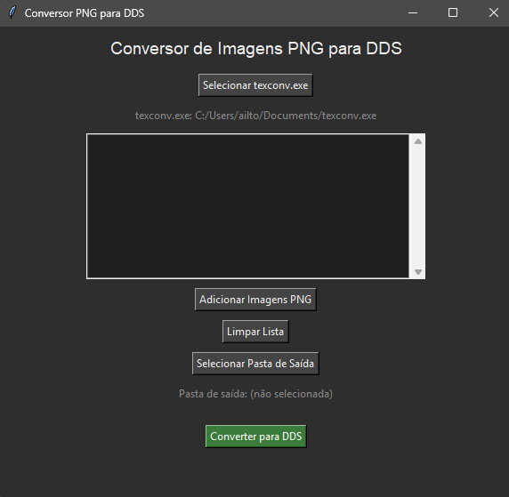

# 🖼️ PNG to DDS Converter

  

  
  

The **PNG to DDS Converter** is a standalone desktop application that provides an intuitive graphical interface to convert `.png` textures into `.dds` format using **texconv.exe**.  

Designed for game developers, modders, and texture artists, it features a modern **dark theme**, simple file management, and one-click conversion to streamline the workflow of preparing assets for engines and mods.  

---

## 🔑 Key Features
- Simple configuration of the **texconv.exe** path (auto-saved in `config.txt`)  
- Add multiple **PNG images** at once with a scrollable list view  
- Choose a **custom output folder** for converted `.dds` files  
- Automatic check for existing files with overwrite confirmation  
- One-click conversion with error handling and completion notifications  
- Modern **dark mode** interface for comfortable use  

---

## 🎯 Common Uses
- Converting textures for **game mods** (e.g., GTA V / FiveM, Microsoft Flight Simulator, etc.)  
- Preparing assets for **DirectX-based engines** that require `.dds`  
- Quickly batch-processing PNGs into optimized DDS textures (format **DXT5**)  
- Keeping a clean and organized workflow with clear input/output paths  

---

## 📥 Installation & Usage
1. **Download the files** directly from this GitHub repository.  
2. Run the app and select the `texconv.exe` path on first launch (it will be saved in `config.txt`).  
3. Add your PNG images → select the output folder → click **Convert to DDS**.  

---

## 🛠️ Credits
Developed by **New Age Studios** or use by the FiveM development community.
